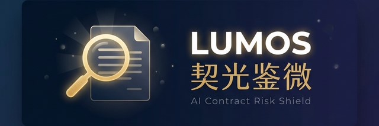

<p align="center">
  
</p>

<p align="center">
  <strong>🔍 开源 AI 合同风险排查助手 · 拍照即查 · 中国劳动法深度适配 · 完全免费</strong>
</p>

<p align="center">
  <a href="https://github.com/7836246/lumos/blob/main/LICENSE"></a>
  <a href="https://github.com/7836246/lumos/stargazers"></a>
  <a href="https://github.com/7836246/lumos/network/members"></a>
  <a href="https://github.com/7836246/lumos/issues"></a>
</p>

<p align="center">
  <a href="#-项目背景">项目背景</a> •
  <a href="#-核心功能">核心功能</a> •
  <a href="#-技术架构">技术架构</a> •
  <a href="./docs/technical-design.md">技术方案</a> •
  <a href="#-快速开始">快速开始</a> •
  <a href="#-贡献与共建">共建</a>
</p>

---

## 📖 项目背景

> *"签了个合同，后来才发现有竞业禁止条款，离职后两年不能去同行，违约金还要赔 50 万。"*

每年有超过 **1200 万人** 进入中国就业市场。他们中的大多数人——尤其是应届毕业生和初入职场的年轻人——在签劳动合同时面临一个共同的困境：

| 😰 痛点 | 现状 |
|:---|:---|
| 💰 **费用高昂** | 审阅一份合同通常收费 500-2000 元，应届生根本负担不起 |
| 📜 **看不懂** | 晦涩的法律术语，不知道哪些条款暗藏玄机 |
| 😶 **不敢问** | 迫于入职压力，不敢对 HR 提供的格式合同提出质疑 |

现有的 AI 合同审查工具，几乎全部是为**企业法务和律师**设计的。

**Lumos · 契光鉴微** 就是要填补这个空白 —— 它是**第一个完全免费、开源、站在劳动者视角的 AI 合同风险排查助手**。

> 💡 *用光，照见契约中每一个隐形陷阱。*

<br>

## ✨ 核心功能

### 🔍 十大坑点智能检测

深度适配中国劳动法，自动扫描合同中最容易给员工挖坑的 **10 类条款**：

> 🔴 **高危区** — 离谱的竞业禁止 · 试用期不发社保、工资打骨折 · 变相强制扣薪
>
> 🟡 **警惕区** — 含糊不清的岗位职责 · "服从公司一切安排" · 苛刻的离职审批
>
> 🟢 **关注区** — 休假权益 · 管辖地争议 · 培训服务期约定

### 📸 极简输入模式

专为移动端场景优化。拿到纸质合同，**拍照即查**（集成端侧 OCR）；同时支持 PDF、Word 上传或直接粘贴合同片段。

### 💬 "说人话"的条款解读

拒绝术语堆砌。AI 会把复杂的条款翻译成你能听懂的 **「大白话」**：

> *"本条款意味着你离职后两年内不能去同行。但由于没明确写补偿金标准，这是严重侵犯你权益的。根据劳动法，如果要签，公司必须每月补偿你离职前工资的 30%。"*

### 🗣️ 一键生成谈判话术

不只告诉你坑在哪，还教你怎么优雅地跟 HR 提要求。AI 会生成可以直接复制、通过微信发送的专业话术，有理有据，不卑不亢。

<br>

## 🏗️ 技术架构

系统采用 **前后端分离** 的现代 Agent 架构，结合了移动端原生性能与后端强大的 AI 编排能力。

```
┌───────────────────────────────────────────────────────────┐
│              📱 Lumos Client (Flutter APP)                │
│                                                           │
│   [UI 表现层]  扫描合同 → 播放极光动画 → 展示风险卡片         │
│   [端侧前置层] camera → mlkit (OCR) → 脱密正则替换          │
│   [通信层]     Dio Streaming (SSE 接收分析过程)             │
└────────────────────────┬──────────────────────────────────┘
                         │  📤 脱敏后的合同纯文本
                         ▼
┌───────────────────────────────────────────────────────────┐
│              🧠 Lumos Server (Python AI Agent)            │
│                                                           │
│   [API 网关]  FastAPI Endpoints                           │
│   [Agent 引擎] LangGraph / PydanticAI                     │
│     ├── 1. 结构化抽取：乱序文本 → 标准字段表单               │
│     ├── 2. 法规检索 (RAG)：关键点 → 向量库查询劳动法         │
│     ├── 3. 风险审查：多维度打分 + 生成谈判话术               │
│     └── 4. 输出格式化：JSON Stream → 前端                  │
│   [数据持久化] SQLModel (合同记录 / 对话历史)                │
└───────────────────────────────────────────────────────────┘
```

### 核心技术栈

<table>
<tr>
<td>

**📱 客户端 — 极致感官篇**

| 技术 | 说明 |
|:---|:---|
| Flutter 3.x (Dart) | Impeller 引擎，丝滑扫描光效动画 |
| Riverpod + go_router | 类型安全的状态管理与深度链接 |
| google_mlkit | 全本地 OCR，隐私数据不出端 |
| Dio (SSE) | 流式实时接收 AI 分析过程 |
| sqflite | 离线缓存历史审查记录 |

</td>
<td>

**🧠 服务端 — 智能大脑篇**

| 技术 | 说明 |
|:---|:---|
| FastAPI (Python 3.12) | 极速 + 自带 Swagger 文档 |
| LangGraph / PydanticAI | 循环节点，模型"懂思考、会改错" |
| LangChain / OpenAI SDK | DeepSeek、Claude、通义千问适配 |
| LlamaIndex | 复杂文档提取与知识图谱 |
| SQLModel (SQLite/PG) | FastAPI 原生 ORM，无缝对接 |

</td>
</tr>
</table>

> 📄 详细的技术选型与架构设计，请参阅 [技术说明文档](./docs/technical-design.md)

<br>

## 📁 项目结构

```
lumos/
├── 📄 README.md
├── 📂 docs/                    # 文档
│   └── technical-design.md     # 技术设计方案
├── 📂 client/                  # Flutter 客户端
│   ├── lib/
│   │   ├── core/               # 主题、路由、API Client
│   │   ├── features/           # 业务模块
│   │   │   ├── home/           # 首页
│   │   │   ├── scanner/        # 合同扫描
│   │   │   ├── report/         # 风险报告
│   │   │   └── splash/         # 启动页
│   │   └── shared/             # 公共组件库
│   └── pubspec.yaml
├── 📂 backend/                 # Python 服务端 (规划中)
│   ├── app/
│   │   ├── api/                # FastAPI 路由
│   │   ├── agent/              # LangGraph 智能体链
│   │   ├── core/               # 配置与 DB
│   │   └── models/             # 数据模型
│   └── pyproject.toml
└── 📂 public/                  # 静态资源
    └── images/
```

<br>

## 🚀 快速开始

### 前置要求

- [Flutter](https://flutter.dev/docs/get-started/install) 3.x+
- [Python](https://www.python.org/) 3.12+（服务端）
- [Dart](https://dart.dev/get-dart) SDK

### 启动客户端

```bash
# 克隆仓库
git clone https://github.com/7836246/lumos.git
cd lumos/client

# 安装依赖
flutter pub get

# 运行
flutter run
```

### 启动服务端（规划中）

```bash
cd lumos/backend
pip install -r requirements.txt
uvicorn app.main:app --reload
```

<br>

## 🤝 贡献与共建

Lumos 是一个为劳动者发声的公益开源项目，我们需要多元化的力量：

- ⚖️ **法律从业者** — 完善判例库、优化风险检测规则
- 💻 **开发者** — 提交 PR，优化系统性能与 UI 细节
- 🧑‍💼 **每一个打工人** — 分享你踩过的坑，让 AI 学习并保护更多人

欢迎提交 [Issue](https://github.com/7836246/lumos/issues) 或 [Pull Request](https://github.com/7836246/lumos/pulls)！

<br>

## ⚖️ 免责声明

**Lumos · 契光鉴微** 是一款基于人工智能的辅助审阅工具。系统检测结果与话术仅供参考，**不构成具有法定效力的专业法律建议**。对于标的额巨大或情况极其复杂的劳动争议，建议您线下咨询专业持证律师。

---

<p align="center">
  <strong>✨ 照见契约中最细微的陷阱</strong>
</p>
<p align="center">
  <sub>Released under the <a href="./LICENSE">Apache 2.0 License</a>. Copyright © 2026 Lumos Contributors.</sub>
</p>
